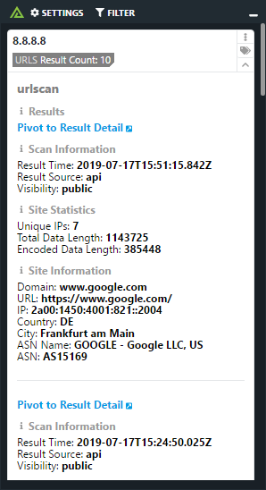

# Polarity urlscan Integration
The Polarity urlscan integration will lookup domains, sha256 hashes, IPv4 and IPv6 addresses and IPv4 CIDRs in urlscan and provide contextual information about the entity. Also, with the use of an API key, you have the ability to submit new URLs to urlscan when searching On Demand.

To learn more about urlscan, please visit: https://urlscan.io/about/

|  |
|---|
|*urlscan.io example* |

## Integration Overview

The `urlscan` integration will return results from the most recent relevant scan performed by the `urlscan` service.  After searching for the scan, additional scan details are returned by retrieving the overall verdict information to include whether the indicator is malicious, the overall score, tags, categories, and brands.

## urlscan Integration Options

### API Key

A valid urlscan API Key which can be generated on the urlscan dashboard. If not provided, you will be treated as an Anonymous user.  An API Key is required for URL submission.

### Allow Manual URL Submission for Scanning

If there are no search results, this allows you to choose to submit the url for scanning when searching On Demand. (API Key Required)

> NOTE: If you submit a url as private and not public the scan result is not searchable. Please save the returned link for your future reference. You can also access your scan results by logging into your urlscan dashboard here https://urlscan.io/user/login/ and then searching for your scans here https://urlscan.io/search/#user:me%20OR%20team:me%20OR%20apikey:me

### View Malicious Indicators Only

If checked, only indicators flagged as malicious will be returned

### Ignored List

This is an alternate option that can be used to specify domains or IPs that you do not want sent to urlscan.  The data must specify the entire IP or domain to be blocked (e.g., www.google.com is treated differently than google.com).

### Ignored Domain Regex

This option allows you to specify a regex to used to ignore domains.  Any domain matching the regex will not be searched.

### Ignored IP  Regex

This option allows you to specify a regex used to ignore IPv4 Addresses.  Any IPv4 matching the regex will not be searched.

### Proxy Screenshots through Polarity Server

If checked, the Overlay Window will receive the URL\'s screenshot from the Polarity server rather than directly from the urlscan website. If your screenshot images are not properly displaying try enabling this option as it can resolve issues in some environments with unsupported web proxy configurations on the client.

## Installation Instructions

Installation instructions for integrations are provided on the [PolarityIO GitHub Page](https://polarityio.github.io/).

## Polarity

Polarity is a memory-augmentation platform that improves and accelerates analyst decision making.  For more information about the Polarity platform please see:

https://polarity.io/
