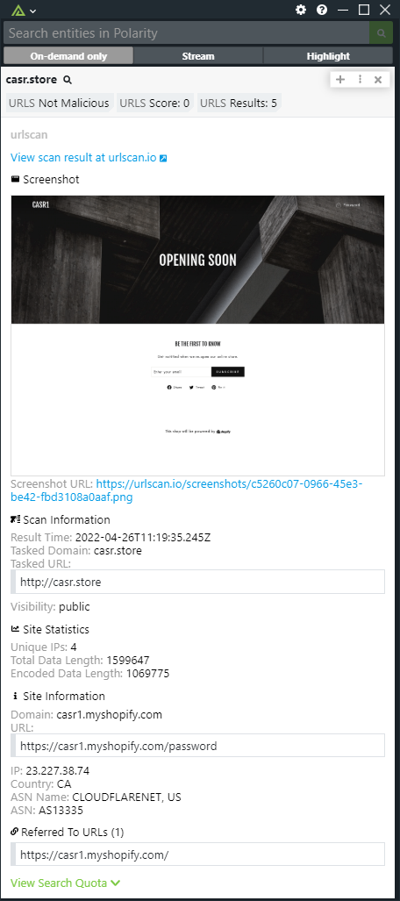

# Polarity urlscan Integration
The Polarity urlscan integration will lookup domains, sha256 hashes, IPv4 and IPv6 addresses and IPv4 CIDRs in urlscan and provide contextual information about the entity. Also, with the use of an API key, you have the ability to submit new URLs to urlscan when searching On Demand.

To learn more about urlscan, please visit: https://urlscan.io/about/

|  |
|---|
|*urlscan.io example* |

## Integration Overview

The `urlscan` integration will return results from the most recent relevant scan performed by the `urlscan` service.  After searching for the scan, additional scan details are returned by retrieving the overall verdict information to include whether the indicator is malicious, the overall score, tags, categories and brands.

## urlscan Integration Options

### API Key
A valid urlscan API Key which can be generated on the urlscan dashboard. (Only required for manual new URL submission)

### Allow Manual URL Submission for Scanning
If there are no search results, this allows you to choose to submit the url for scanning when searching On Demand. (API Key Required)
> NOTE: If you submit a url as private and not public the scan result is not searchable. Please save this link for your future reference. The only place in the future that a private submission will be found is on your user profile on the urlscan.io dashboard (`https://urlscan.io/user/` or `https://urlscan.io/user/search/#`)

### View Malicious Indicators Only
If checked, only indicators flagged as malicious will be returned

### Ignored List

This is an alternate option that can be used to specify domains or IPs that you do not want sent to UrlScan.  The data must specify the entire IP or domain to be blocked (e.g., www.google.com is treated differently than google.com).

### Ignored Domain Regex

This option allows you to specify a regex to set domains.  Any domain matching the regex will not be looked up.

### Ignored IP  Regex

This option allows you to specify a regex to set IPv4 Addresses.  Any IPv4 matching the regex will not be looked up.

## Installation Instructions

Installation instructions for integrations are provided on the [PolarityIO GitHub Page](https://polarityio.github.io/).

## Polarity

Polarity is a memory-augmentation platform that improves and accelerates analyst decision making.  For more information about the Polarity platform please see:

https://polarity.io/
